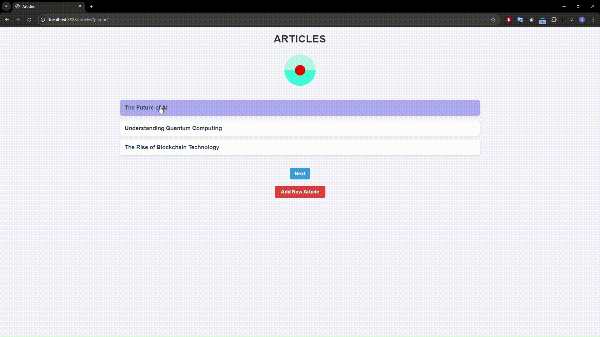

# Articles App

## Описание проекта

**Articles App** — это простое веб-приложение на языке Go с использованием базы данных PostgreSQL. Приложение позволяет создавать статьи, просматривать список статей, а также просматривать содержимое каждой статьи на отдельной странице.



### Основные функции:
- Отображение списка статей (по 3 на страницу).
- Возможность добавления новых статей через интерфейс администратора.
- Пагинация для удобного просмотра статей.
- Возможность просмотра полной статьи по нажатию на ссылку.

## Стек технологий

- **Go (Golang)** — серверная логика.
- **PostgreSQL** — база данных для хранения статей.
- **HTML + CSS** — фронтенд часть для отображения интерфейса.

## Запуск проекта

- Поменять в connection/connection.go `user=postgres password=postgres dbname=dbname sslmode=disable` на параметры вашей БД

- Добавить таблицу
```sql
CREATE TABLE articles (
    id SERIAL PRIMARY KEY,
    title TEXT,
    content TEXT
); 
```
- Установить все необходимые зависимости Go:

```
go mod tidy
```

- Запуск:

```
go run main.go
```